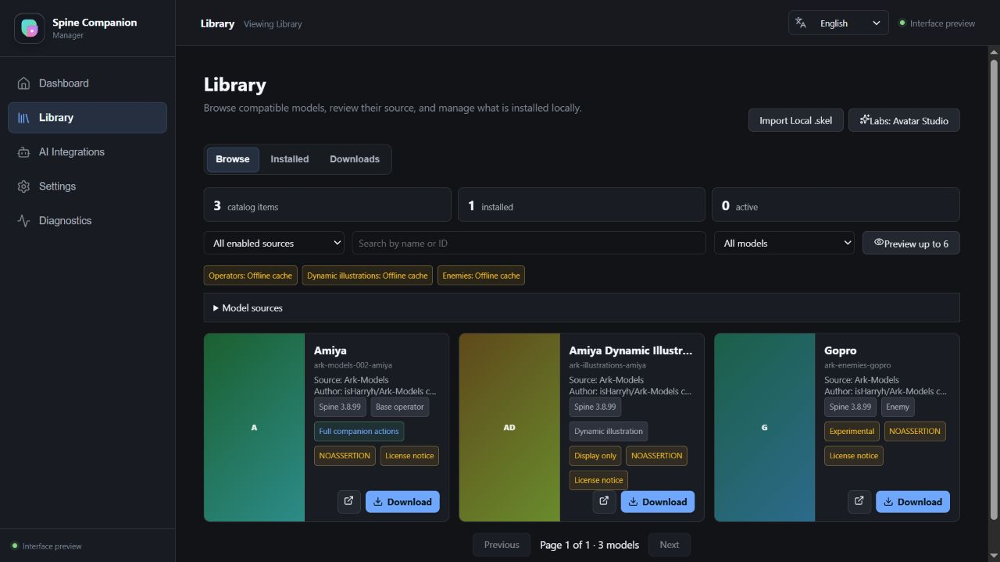

# Spine Companion

[English](README.md) | [简体中文](README.zh-CN.md)

Spine Companion 是面向 AI 辅助编程的本地桌面状态陪伴。它把 AI 工具主动上报的工作阶段
转换为角色动画、提醒和一眼可见的状态，让你不用离开日常工作区也能看到任务正在工作、
等待你、检查中或已经完成。

它是 IDE、终端和 AI 工具的补充，不会替代其中任何一个。桌宠只显示已接入工具主动上报的
阶段，不会根据无关的桌面活动猜测 AI 状态。

## 下载

从 [GitHub Releases](https://github.com/cb8010d6/spine-companion/releases) 下载当前版本。
Windows 安装包是稳定目标；macOS 和 Linux 安装包是未签名预览版，适合评估使用。

同一 Release 中的 `SHA256SUMS.txt` 可用于校验下载文件。



## 首次使用角色，无需终端

1. 安装 Spine Companion，从桌面或开始菜单启动。
2. 打开 **Manager > Library**，选择兼容角色并点击 **Download and use**。
3. 在 **Manager > Settings** 调整大小和位置，再从托盘菜单显示桌宠。

Library 会把下载的模型放入用户数据目录。首次使用不需要编辑 JSON 文件，也不需要运行命令。

## Manager 连接 AI：Codex

1. 打开 **Manager > AI Integrations**，选择 **Codex**。
2. 查看待写入的 MCP 配置并确认。Manager 会写入已安装应用的可执行文件入口，并在修改
   Codex 配置前创建备份。
3. 重启 Codex 或打开新会话；Codex 上报工作阶段时保持 Spine Companion 运行。

该集成使用本地 stdio MCP 入口，通过 companion 的本地 HTTP API 工作。详细 MCP 字段、
开发兜底和排障步骤见 [Codex MCP 指南](docs/guides/codex-mcp.zh-CN.md)。

MCP 配置只是让上报工具可用，并不会自动揭示所有 AI 状态。AI 工具必须在工作阶段主动调用
上报工具，且 Spine Companion 需要保持运行。请先运行安装包 MCP 自检，再启动一个真实任务，
并在 **Manager > AI Integrations** 中确认第一次工作上报。

## 功能

- 透明、置顶的 Spine 渲染，支持拖动、点击、缩放和状态动画。
- Manager Library、Installed、下载、诊断、设置和更新检查。
- 本地提醒、进度气泡、托盘控制和最近状态历史。
- 支持 Codex 等 MCP AI 工具，并提供配置备份和恢复。
- 为开发和自动化提供浏览器预览及本地 HTTP/SSE 集成。
- Avatar Studio（实验功能）支持试用和恢复本地角色变更。

## 平台矩阵

| 平台 | 支持目标 | Release 安装包 |
| --- | --- | --- |
| Windows 10/11 x64 | Stable target | NSIS `.exe` |
| macOS Apple Silicon | Preview | `.dmg` |
| macOS Intel | Preview | `.dmg` |
| Linux x64 | Preview | `.AppImage`、`.deb` |

预览包未签名，可能受桌面环境、显卡驱动、窗口合成或 Gatekeeper 影响。它们用于评估，不是
稳定支持目标。

## 模型兼容性与权利提示

Spine Companion 加载 Spine 3.8 兼容模型目录，其中应包含 skeleton、atlas 以及 atlas
引用的贴图。动作覆盖取决于模型实际包含的动画名称和元数据。

本仓库和 Release 不包含明日方舟、Ark-Models 或其他受版权保护的模型文件。只有在你拥有
使用权限时才下载或使用模型，并遵循上游许可证和署名要求。Library 列出模型不代表你拥有
再分发权。

## 文档

- [用户指南](docs/guides/user-guide.zh-CN.md)
- [部署、升级与排障](docs/guides/deployment.zh-CN.md)
- [AI 工具集成](docs/guides/ai-tools.zh-CN.md)
- [Codex MCP 集成](docs/guides/codex-mcp.zh-CN.md)
- [架构概览](docs/architecture/overview.zh-CN.md)
- [运行时 Bridge 契约](docs/architecture/runtime-bridge.zh-CN.md)
- [发布说明](docs/releases/README.zh-CN.md)

## 开发

可复现构建使用 Bun 1.3.13 和 `rust-toolchain.toml` 固定的 Rust 版本。
升级 Bun 时同步更新 `package.json`、`bun.lock` 和 CI 版本。常用流程：

```bash
bun install --frozen-lockfile
bun run dev
```

提交变更前运行：

```bash
bun run lint
bun run type-check
bun run test
bun run check
bun run check:mcp
bun run build
cargo fmt --manifest-path src-tauri/Cargo.toml --all --check
cargo clippy --manifest-path src-tauri/Cargo.toml --locked --all-targets -- -D warnings
cargo test --manifest-path src-tauri/Cargo.toml --locked
```

原生打包和模型设置说明见[部署指南](docs/guides/deployment.zh-CN.md)。仓库协作流程和审查要求
见 [CONTRIBUTING.md](CONTRIBUTING.md)。

## 安全与许可证

报告漏洞前请阅读 [SECURITY.md](SECURITY.md)。不要在公开 issue 中提交密钥、私有模型文件
或未脱敏的诊断报告。

Spine Companion 使用 [MIT License](LICENSE) 发布。第三方声明单独收录在
[THIRD_PARTY_NOTICES.md](THIRD_PARTY_NOTICES.md)。
