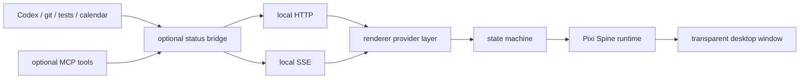

# Architecture

[English](overview.md) | [简体中文](overview.zh-CN.md)

The desktop app keeps high-frame animation local. External systems publish status
or events through the packaged local HTTP API, its SSE stream, or an optional MCP
bridge; the renderer translates those states into Spine runtime animation
transitions.

MCP is intentionally not in the rendering path. It is better suited for exposing
current task data and events, while the desktop runtime and Pixi own the
transparent window, input handling, and frame loop.
