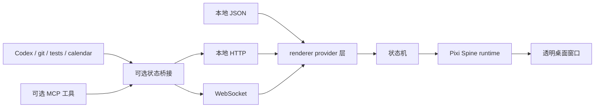

# 架构

[English](overview.md) | [简体中文](overview.zh-CN.md)

高帧动画始终在桌面应用本地渲染。外部系统只负责通过 JSON、HTTP、WebSocket 或 MCP
桥接发布状态和事件，renderer 再把状态转换为 Spine runtime 动画切换。

MCP 不在渲染路径里。它更适合提供当前任务数据和事件；透明窗口、输入处理和动画循环由
桌面运行时与 Pixi 负责。
