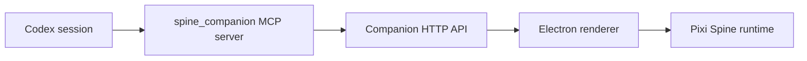

# Codex MCP Bridge

The bridge is a local stdio MCP server. Codex launches it, the bridge calls the
companion HTTP API, and the desktop renderer reacts to state changes.



Install into local Codex config:

```bash
npm run mcp:install:codex
```

This writes:

```toml
[mcp_servers.spine_companion]
command = "node"
args = ["C:/path/to/spine-companion/scripts/mcp-companion-server.mjs"]
env = { COMPANION_API = "http://127.0.0.1:17388" }
```

Restart Codex or open a new session after installing. The current Codex session
usually cannot hot-load newly added MCP servers.

Tools exposed:

- `companion_get_state`: read current desktop state.
- `companion_set_state`: set one of the state machine states.
- `companion_reminder`: schedule a local reminder.
- `companion_report_codex_phase`: map Codex phases like `editing`, `reviewing`,
  `succeeded`, or `failed` into companion states.

The companion desktop app or `npm run dev:api` must be running before these
tools are useful.
