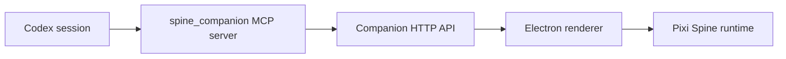

# Codex MCP 桥接

[English](codex-mcp.md) | [简体中文](codex-mcp.zh-CN.md)

桥接服务是一个本地 stdio MCP server。Codex 启动它后，桥接服务调用 companion HTTP API，
桌面 renderer 根据状态变化切换动画。



安装到 Codex 配置：

```bash
npm run mcp:install:codex
```

这会写入：

```toml
[mcp_servers.spine_companion]
command = "node"
args = ["C:/path/to/spine-companion/scripts/mcp-companion-server.mjs"]
env = { COMPANION_API = "http://127.0.0.1:17388" }
```

安装后重启 Codex 或打开新会话。当前会话通常不会热加载新增 MCP server。

工具：

- `companion_get_state`：读取当前桌面状态。
- `companion_set_state`：设置状态机状态。
- `companion_reminder`：创建本地提醒。
- `companion_report_codex_phase`：把 `editing`、`reviewing`、`succeeded` 等 Codex
  阶段映射到 companion 状态。

MCP 本身不会自动推送 Codex 状态，它只是暴露工具。要让 AI 主动上报，运行：

```bash
npm run skill:install
npm run ai:configure -- --target all
```

桌面应用或 `npm run dev:api` 必须运行，MCP 工具才有 API 可调用。
